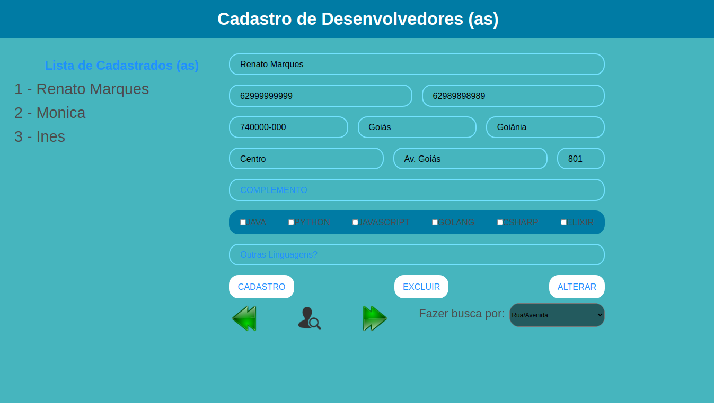
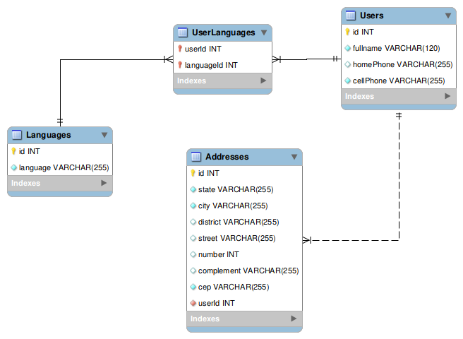

<h1 align="center"> 
	🚧  Projeto 🚀 Em construção...  🚧
</h1>

# API - Cadastro de desenvolvedores
 

# Sobre o projeto

Esta é uma aplicação full stack web construída para treinamento de teste técnico - uma das  fases dos processos de contratação das empresas. Organizado pela [Trybe](https://www.betrybe.com/).

A aplicação consiste em criar, atualizar e excluir o cadastro de um/uma Desenvolvedor(a) Web.

## Itens obrigatórios:
- [X] O sistema deve suportar as seguintes operações: Insert, Update, Select e Delete.
- [X] Realizar pesquisas por todos os campos do cadastro da pessoa dev, inclusive endereço.
- [X] Listar todas as pessoas devs que possuem determinada linguagem (informada como parâmetro) como especialidade.
- [X] Estar no padrão REST.
- [ ] Utilizar alguma ferramenta de validação (exemplo, YUP).
- [X] Escrever apenas funções especializadas (Realizam somente uma operação).
- [ ] Utilizar o Swagger para documentação.
- [ ] Criar os testes unitários.
- [X] Implementar o código de forma limpa (clean code).
- [X] Realizar o deploy em qualquer serviço de cloud (Heroku, AWS, Azure, etc.).
- [X] Utilizar o GIT(commits descritivos).

## Layout
<h1 align="center">
  
</h1>

## Modelo conceitual
<h1 align="center">
  
</h1>

# Tecnologias utilizadas
## Back end
   &nbsp;    &nbsp;   &nbsp;   &nbsp;
   &nbsp;    &nbsp;   &nbsp;   &nbsp;
   &nbsp;    &nbsp;   &nbsp;   &nbsp;

## Front end
  &nbsp;    &nbsp;   &nbsp;   &nbsp;
   &nbsp;    &nbsp;   &nbsp;   &nbsp;
   &nbsp;    &nbsp;   &nbsp;   &nbsp;
   &nbsp;    &nbsp;   &nbsp;   &nbsp;

## Implantação em produção
   &nbsp;    &nbsp;   &nbsp;   &nbsp;
   &nbsp;    &nbsp;   &nbsp;   &nbsp;

# Como executar o projeto
O deploy do Projeto é parcial devido a impossibilidade de realizar cadastro de cartão de crédito nos sites como Heroku e AWS. A adição do cartão é necessária para acrescentar o app que faz a manipulação do banco de dados.
Contudo, o front-end está disponível para ser acessado pelo endereço https://api-api-register-dev-frontend.herokuapp.com/ .
Rodando o backend, localmente, é possível fazer o teste da aplicação.
Em resumo: só é possivel testar a aplicação localmente.

